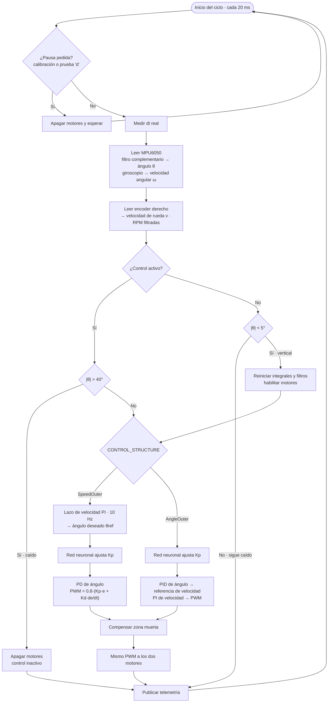
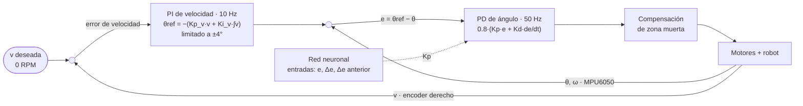
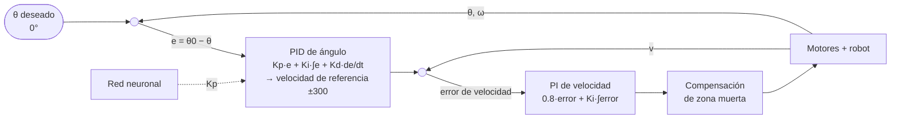
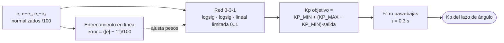

# 🤖 Balancín-ControlRN (ESP32-S3)

> Basado en repositorio: `git@github.com:eatechnology1/Balancin-ControlRN.git`

Firmware para un **robot balancín** (péndulo invertido sobre dos ruedas) basado en **ESP32-S3**. Su único objetivo es mantener el robot de pie. Para eso combina:

- **Control en cascada** de velocidad y ángulo, con dos estructuras seleccionables.
- Una **red neuronal feed-forward** que ajusta en línea la ganancia proporcional (`Kp`) del lazo de ángulo.
- **Compensación de la zona muerta** de los motores.

---

## ✨ Características principales

- 🦾 **Dos estructuras de control** que se eligen con una línea en `config.h`, sin perder los parámetros de ninguna:
  - `SpeedOuter` (activa por defecto): estructura estándar de balancín. Un PI de velocidad fija el ángulo deseado y un PD de ángulo genera el PWM. Mantiene el robot en su sitio.
  - `AngleOuter`: estructura original. Un PID de ángulo genera una referencia de velocidad y un PI de velocidad genera el PWM.
- 🧠 **Red neuronal** (3-3-1, librería local `Neural_Networks_FF`) que adapta `Kp` entre `KP_MIN` y `KP_MAX`. Si ambos valen lo mismo, `Kp` queda fija.
- 📐 **Ángulo** con filtro complementario (0.98 giroscopio / 0.02 acelerómetro) y el filtro pasa-bajas interno del MPU6050 a 42 Hz.
- ⚙️ **Zona muerta de motores** compensada de forma continua (sin saltos en PWM = 0), con una prueba automática para medirla.
- 🕒 **FreeRTOS**: `TaskBalanceo` a 50 Hz en el núcleo 1, con período fijo (`vTaskDelayUntil`) y `dt` medido.
- 🛡️ **Seguridad**: motores apagados si |ángulo| > 40°; se reactivan con el robot vertical (|ángulo| < 5°).
- 💾 **Calibración persistente** de la MPU en memoria no volátil (NVS), sin interrumpir una lectura I2C.

---

## 🧭 Lógica de control

### Diagrama general del ciclo de control (cada 20 ms)



### Estructura `SpeedOuter` (por defecto)



1. **Lazo externo de velocidad (PI, 10 Hz)**: promedia la velocidad de la rueda en cada período de 100 ms y calcula el ángulo deseado:
   $\theta_{ref} = \theta_0 - \text{sat}_{\pm 4°}\left(K_p^v\,v + K_i^v \int v\,dt\right)$.
   - Si el robot avanza, baja `θref` y el lazo interno lo frena.
   - El término integral (proporcional a la distancia recorrida) lo devuelve a su posición inicial. También absorbe la diferencia entre el cero calibrado y el punto de equilibrio real.
   - El signo lo fija `SPEED_LOOP_SIGN = -1` (ver [Por qué el signo es −1](#-por-qué-el-signo-del-lazo-de-velocidad-es-1)).
2. **Lazo interno de ángulo (PD, 50 Hz)**: `PWM = 0.8·(Kp·e + Kd·de/dt)`, con `e = θref − θ`.
   - La derivada usa directamente el giroscopio (`de/dt = −ω`): menos ruido y sin retardo.
   - El factor 0.8 (`ANGLE_LOOP_PWM_GAIN`) hace que `Kp` y `Kd` signifiquen lo mismo que en `AngleOuter`.
3. **Red neuronal**: ajusta `Kp` en cada ciclo (ver más abajo).

### Estructura `AngleOuter` (original)



Se conserva para comparar. Como la referencia de velocidad (±300 RPM) es inalcanzable para motores de unas 70 RPM, en la práctica se comporta como un PID de ángulo directo al PWM y no corrige que el robot se desplace.

### Red neuronal (Kp adaptativa)



- Si |e| > `NN_ERROR_BAND` (1°), la red sube `Kp`; si es menor, la baja.
- La salida está limitada a [0, 1], así que `Kp` nunca sale de `KP_MIN..KP_MAX` ni cambia de signo.
- El filtro evita que `Kp` salte entre sus límites de un ciclo a otro, lo que producía vibración.
- Configuración actual: `KP_MIN = KP_MAX = 70`, es decir, `Kp` fija. Es el valor con el que el robot se sostiene; la sintonía manual previa halló estable el rango 50-70.

### Compensación de zona muerta

Por debajo de un PWM de unos 22-26 (medido con la prueba `d`), los motores no vencen la fricción ni el juego de la reductora. El PWM del controlador `u` se transforma así:

- $|u| \ge 4$: $u_{motor} = \text{signo}(u)\cdot\left(DB + |u|\cdot\frac{255-DB}{255}\right)$
- $|u| < 4$: interpolación lineal desde 0, para que el ruido en reposo no se convierta en golpes.

Se usa `PWM_DEADBAND = 14`, menos que lo medido: arrancar desde parado cuesta más que mantener el giro, y compensar de más produce vibración. Con 0 se desactiva.

### 🔄 Por qué el signo del lazo de velocidad es −1

Los motorreductores (1:119) se comportan casi como fuentes de velocidad. Con el lazo interno PD, en régimen permanente el robot avanza unas 15 RPM por cada grado que `θref` está por encima del punto de equilibrio. En la primera versión, avanzar subía `θref`: eso lo hacía avanzar más, una realimentación positiva. El robot equilibraba al arrancar y luego se alejaba cada vez más rápido, como si el cero se hubiera corrido. Con el signo −1, avanzar baja `θref` y frena al robot.

---

## 🧩 Estructura del código

| Archivo | Contenido |
|---|---|
| `src/main.cpp` | `setup()` y `loop()`: inicialización, botón de calibración, comandos y telemetría por Serial. |
| `include/config.h` | Pines, PWM, encoders, estructura de control y todos los parámetros ajustables. |
| `encoders.h/.cpp` | ISRs de encoders (IRAM-safe), lectura atómica y RPM filtradas. |
| `motors.h/.cpp` | PWM LEDC, driver TB6612FNG y compensación de zona muerta. |
| `mpu_block.h/.cpp` | MPU6050: conexión, filtro pasa-bajas, calibración en NVS y filtro complementario. |
| `nn_cascade_block.h/.cpp` | Red neuronal, las dos estructuras de control y sus ganancias. |
| `tasks_block.h/.cpp` | `TaskBalanceo`, seguridad, pausa y reanudación, y telemetría. |
| `motor_test.h/.cpp` | Prueba de zona muerta de los motores (comando `d`). |
| `lib/Neural_Networks_FF`, `lib/Dynamic_Array` | Librerías locales de la red neuronal. |

En `test/` se guardan sketches y versiones anteriores (`*.old`) como histórico; no se compilan.

---

## 🎛️ Parámetros de ajuste

| Parámetro | Dónde | Valor | Qué hace |
|---|---|---|---|
| `CONTROL_STRUCTURE` | `config.h` | `SpeedOuter` | Estructura de control activa (`SpeedOuter` / `AngleOuter`). |
| `KP_MIN`, `KP_MAX` | `config.h` | 70 / 70 | Rango de `Kp` que puede elegir la red. Iguales = `Kp` fija. |
| `Kd_angle` | `nn_cascade_block.cpp` | 1.25 | Acción derivativa del lazo de ángulo (amortigua). |
| `Kp_v`, `Ki_v` | `nn_cascade_block.cpp` | 0.05 / 0.03 | Ganancias del lazo de velocidad (`SpeedOuter`). |
| `SPEED_LOOP_SIGN` | `config.h` | −1 | Signo del lazo de velocidad. |
| `MAX_TILT_REF_DEG` | `config.h` | 4° | Límite del ángulo deseado que puede pedir el lazo de velocidad. |
| `Ki_angle`, `Kp_speed`, `Ki_speed` | `nn_cascade_block.cpp` | 1.0 / 0.8 / 0 | Ganancias de `AngleOuter`. |
| `PWM_DEADBAND` | `config.h` | 14 | Compensación de zona muerta (0 = desactivada). |
| `MPU_DLPF_MODE` | `config.h` | 3 (42 Hz) | Filtro pasa-bajas interno del MPU6050. |
| `MAX_ANGLE`, `REARM_ANGLE` | `config.h` | 40° / 5° | Ángulo de caída y de reactivación. |

**Guía rápida con `SpeedOuter`**:
- Si el robot se aleja cada vez más rápido y `Ref` se queda en ±4°, cambia `SPEED_LOOP_SIGN`.
- Si oscila lento adelante-atrás (1-3 s), baja `Ki_v` y luego `Kp_v`.
- Si vibra rápido alrededor del equilibrio, baja `Kp` o `PWM_DEADBAND`.

---

## 🔧 Hardware

- 🧩 **Placa**: ESP32-S3 (N16R8), configurada como `esp32-s3-devkitm-1`.
- 🎛️ **IMU**: MPU6050 (I2C, SDA=41, SCL=42).
- ⚙️ **Driver de motores**: TB6612FNG.
  - Izquierdo: `AIN1`=7, `AIN2`=6, `PWMA`=5.
  - Derecho: `BIN1`=16, `BIN2`=17, `PWMB`=18.
  - `STBY`=15.
- 🚗 **Motores** 25GA370 12 V 100 RPM con encoder (44 pulsos por vuelta del motor, reducción 1:119). Con LiPo 2S (8.4 V) llegan a unas 70 RPM.
  - Encoder derecho A/B = 3/46.
  - Encoder izquierdo A/B = 9/11. Está defectuoso, así que la velocidad se mide sólo con la rueda derecha (`USE_LEFT_ENCODER = false`).
- 🔘 **Botón de calibración**: `BTN_CAL`=10 (activo en LOW).

Los pines están fijados por la PCB. GPIO 3 y 46 son pines de arranque (*strapping*) del ESP32-S3.

---

## 🧮 Uso

1. **Encendido**: se inician los motores (deshabilitados), la MPU6050 y su calibración, los encoders, la red neuronal y la tarea de control. Se imprime la estructura de control activa.
2. **Activación**: pon el robot vertical (|ángulo| < 5°) y el control se activa solo.
3. **Caída**: si |ángulo| > 40°, se apagan los motores hasta que vuelva a estar vertical.
4. **Calibración**: con el robot quieto y vertical, pulsa y suelta `BTN_CAL` o envía `c`. El control se pausa, se guardan los offsets y se reanuda.

### Telemetría (Serial, 115200 baudios, cada 100 ms)

```
Ang: 0.53 | Ref: -0.21 | w: -4.2 | PWM: -12.4 | RPM L: 0.0 | RPM R: -2.9 | Kp: 70.00 | dt: 0.0200 | ACTIVO
```

| Campo | Significado |
|---|---|
| `Ang` | Ángulo medido (°). Negativo = inclinado hacia adelante. |
| `Ref` | Ángulo deseado que pide el lazo de velocidad (siempre 0 en `AngleOuter`). |
| `w` | Velocidad angular del giroscopio (°/s). |
| `PWM` | Salida del controlador, antes de compensar la zona muerta. |
| `RPM L` / `RPM R` | Velocidad de cada rueda. Positiva = avance. |
| `Kp` | `Kp` actual del lazo de ángulo. |
| `dt` | Período real del ciclo de control (s). |

### Comandos por el monitor serie

Escribe la letra en el monitor (no hace falta Enter):

| Tecla | Acción |
|---|---|
| `d` | Prueba de zona muerta. Sujeta el robot vertical con las ruedas en el suelo: sube el PWM hasta que la rueda derecha gira de forma sostenida e imprime el PWM mínimo en cada sentido. Cualquier tecla la aborta. |
| `c` | Calibrar la MPU (igual que el botón). |
| `t` | Pausar o reanudar la telemetría. |
| `?` | Ayuda. |

`d` y `c` pausan el control antes de actuar. Al terminar, el control se reactiva cuando el robot se pone vertical.

---

## 🚀 Compilación y carga (PlatformIO)

```
git clone https://github.com/eatechnology1/Balancin-ControlRN.git
cd Balancin-ControlRN
pio run -t upload
pio device monitor -b 115200
```

- Si la carga falla con `Wrong boot mode`, mantén pulsado **BOOT** al empezar la carga (hasta que aparezca `Connecting...` seguido de `Writing`).
- Las librerías **Neural_Networks_FF** y **Dynamic_Array** están en `lib/` y PlatformIO las detecta automáticamente. La del MPU6050 se descarga desde `lib_deps`.

Más detalle en [Doc_Technical.md](Doc_Technical.md).

---

## 🖥️ HMI (en desarrollo)

Laboratorio web para monitorear, sintonizar y registrar el robot desde el PC o el celular. Plan, decisiones y fases en [docs/hmi/PLAN.md](docs/hmi/PLAN.md).
