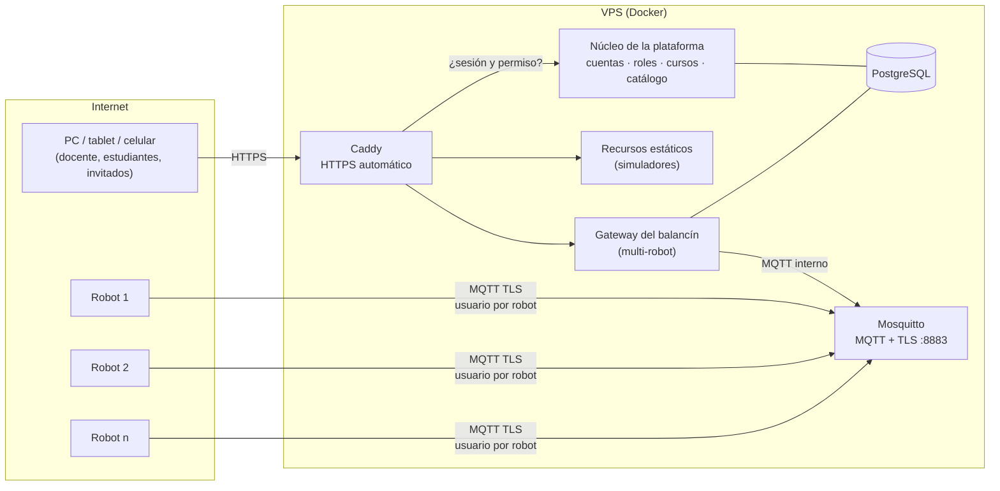

# F7 · Servidor propio y plataforma de docencia (planificación)

Estado: **planificada, no iniciada** (2026-09-26). Este documento fija el alcance, la arquitectura y
las decisiones pendientes. No se ejecuta todavía.

---

## 1. Visión

Un servidor propio (dominio propio, sin depender de la universidad) que funcione como **plataforma
de docencia**: un solo lugar con cuentas, cursos y los recursos didácticos del autor.

- **Recursos** de dos tipos:
  - *Estáticos*: simuladores y artefactos que corren en el navegador (p. ej. `Simulador_Balancin`,
    un solo HTML).
  - *Laboratorios en vivo*: con hardware real conectado por internet (este balancín; otros futuros).
- **Personas**: docente, estudiante e invitado.
- **Cursos o asignaturas**, con estudiantes matriculados y recursos asignados a cada curso.

El Laboratorio del balancín es el **primer laboratorio en vivo** de la plataforma y el que define los
requisitos técnicos más exigentes (tiempo real, robots en internet, seguridad de mando).

---

## 2. Decisiones ya tomadas

| Tema | Decisión |
|---|---|
| Alojamiento | VPS de pago básico con Linux y Docker |
| Dominio | Propio, comprado, no ligado a unipamplona.edu.co |
| Robots | Varios a la vez (cada grupo con el suyo) |
| Roles | Docente, estudiante, invitado |
| Alcance | Plataforma general de docencia; el balancín es un módulo |

---

## 3. Arquitectura propuesta

- **Un solo punto de entrada** (Caddy): HTTPS con certificados Let's Encrypt renovados solos.
- **Acceso centralizado**: antes de servir cualquier recurso, Caddy pregunta al núcleo si la
  sesión es válida y qué permisos tiene (*forward auth*). Cada recurso recibe el usuario y el rol en
  cabeceras y no maneja contraseñas. Así un simulador estático queda protegido sin tocar su código.
- **Robots por MQTT con TLS** (puerto 8883): cada robot tiene su usuario y clave, y una lista de
  acceso (ACL) que sólo le permite publicar y leer `balancin/<su-id>/…`. El robot sale hacia el
  servidor; no hace falta abrir puertos en la red del laboratorio.
- **El control sigue en el robot.** Internet sólo transporta monitoreo, parámetros y comandos. La
  latencia esperada (50–150 ms) es suficiente para eso; la parada de emergencia también funciona
  localmente (botón físico y teclas por USB).

### Qué cambia en lo ya construido

| Componente | Cambio |
|---|---|
| Firmware | MQTT con TLS (`mqtts://`, certificado raíz ISRG Root X1) y usuario/clave del robot en NVS, configurables por USB desde la HMI. Sin cambios en el protocolo |
| Gateway | De un enlace a **varios** (`RobotLink` por robot, registro de robots), identidad por cabeceras del núcleo, permisos por rol, PostgreSQL en vez de SQLite |
| HMI | Selector de robot; lo que cada rol puede ver y tocar; sin formulario de clave (lo hace el núcleo) |
| Protocolo | Sin cambios (v1) |

### Permisos del laboratorio del balancín

| Acción | Docente | Estudiante | Invitado |
|---|---|---|---|
| Ver telemetría, escena, trazas | todos los robots | robots asignados | robots que el docente comparta |
| Parada de emergencia | ✔ | ✔ (sus robots) | ✔ (siempre: es seguridad) |
| Cambiar parámetros, comandos, WiFi | ✔ | ✔ (sus robots) | — |
| Historial: ver, exportar CSV | todo | sus sesiones y las de su grupo | — |
| Historial: borrar | ✔ | — | — |
| Registrar robots y credenciales | ✔ | — | — |

---

## 4. Modelo de la plataforma (núcleo)

| Entidad | Contenido |
|---|---|
| Usuario | nombre, correo, rol global (docente / estudiante / invitado), estado |
| Curso | asignatura, periodo (p. ej. 2026-II), docente(s) |
| Matrícula | usuario ↔ curso, con grupo (para asignar robots a equipos) |
| Recurso | tipo (estático / laboratorio en vivo), título, descripción, ruta |
| Asignación | recurso ↔ curso (qué ve cada curso), fechas opcionales |
| Robot | id (`balancin-b884`), credenciales MQTT, curso y grupo asignados |

---

## 5. Opciones abiertas (decidir al iniciar F7)

| # | Tema | Opciones | Recomendación |
|---|---|---|---|
| A | Núcleo de la plataforma | **(1)** Propio en FastAPI (mismo lenguaje que el gateway; hecho a medida; más trabajo). **(2)** Authentik o Keycloak para cuentas e inicio de sesión + catálogo y cursos propios (cuentas robustas listas; un servicio más). **(3)** Moodle (cursos y roles completos; pesado y difícil de integrar con laboratorios en vivo) | (2): no reinventar la seguridad de cuentas y mantener propio lo didáctico |
| B | Rutas | Subdominios (`balancin.dominio`) o rutas (`dominio/labs/balancin`) | Rutas para recursos; subdominio sólo para el broker (`mqtt.dominio`) |
| C | Repositorios | La plataforma en un repositorio nuevo; cada recurso en el suyo, publicado como imagen Docker | Sí: este repo sigue siendo el del balancín |
| D | Telemetría | Toda la sesión a 50 Hz (~20 MB/h por robot) o política de retención (p. ej. completa 30 días, luego submuestreada) | Retención configurable; con 8 robots, 2 h de clase ≈ 320 MB |
| E | Datos personales | Mínimos necesarios, aviso de privacidad y consentimiento (Ley 1581 de 2012) | Definirlo antes de matricular estudiantes |

---

## 6. Infraestructura y costos estimados

| Ítem | Referencia | Costo aproximado |
|---|---|---|
| VPS | 2 vCPU, 4 GB RAM, 40 GB disco (Hetzner CX22, DigitalOcean básico) | 5–8 USD/mes |
| Dominio | `.com`, `.co`, `.dev` | 10–40 USD/año |
| Copias de seguridad | instantánea diaria del VPS + volcado de la base a almacenamiento externo | 1–2 USD/mes |
| Certificados HTTPS | Let's Encrypt vía Caddy | gratis |

Operación: actualizaciones con `docker compose pull && up -d`, monitoreo de disponibilidad
(p. ej. Uptime Kuma), registros centralizados, cortafuegos (sólo 80, 443, 8883 y SSH con llave).

---

## 7. Fases propuestas

| Fase | Contenido | Resultado |
|---|---|---|
| **F7.0** | Comprar dominio, contratar VPS, Docker + Caddy + HTTPS; publicar el balancín **tal como está** (un robot, clave de F6, MQTT con TLS) | Laboratorio accesible por internet con HTTPS |
| **F7.1** | Firmware: MQTT con TLS y credenciales por robot; Mosquitto con usuarios y ACL | Robots en internet de forma segura |
| **F7.2** | Núcleo: cuentas, roles, inicio de sesión, protección de todos los recursos (decisión A) | Acceso con cuenta propia |
| **F7.3** | Cursos, matrículas, grupos, catálogo de recursos | La plataforma de docencia |
| **F7.4** | Gateway multi-robot, permisos por rol, PostgreSQL, selector de robot en la HMI | Toda la clase a la vez |
| **F7.5** | Migrar otros recursos (Simulador_Balancin y los demás) | Plataforma con contenido |
| **F7.6** | Operación: copias de seguridad, retención de telemetría, monitoreo, privacidad | Servicio sostenible |

F7.0 y F7.1 sirven solas: dan acceso por internet al laboratorio actual mientras se construye el
resto.

---

## 8. Requisito en el aula

El robot necesita una red WiFi con internet y clave normal (WPA2-PSK): router del laboratorio o
el hotspot de un celular. Las redes con portal de acceso o WPA2-Enterprise (como la WiFi
universitaria) no le sirven.
