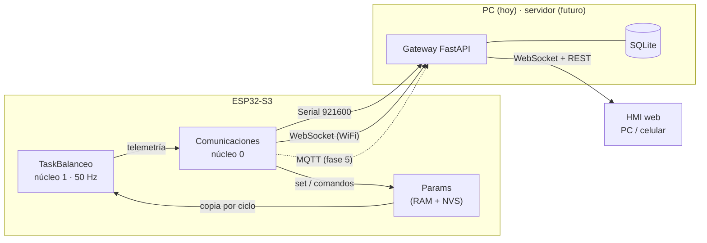

# HMI del balancín: plan de diseño

Laboratorio de pruebas, análisis y monitoreo del prototipo real. Este documento fija las decisiones de
arquitectura, el alcance de cada fase y el criterio con que se da por terminada. Se actualiza al cerrar
cada fase.

Estado (2026-09-26):
- **F0 cerrada y validada en el robot**: `protocol_check.py --save` 20/20; cambio de `kd_angle` a 2.0 con el robot equilibrando, aplicado en el ciclo siguiente sin caída.
- **F4 implementada** (fw 0.4.0): WiFi con red propia por defecto (clave única por robot) o red local con respaldo, WebSocket, mDNS, canales Serial/WiFi independientes; gateway con transporte WiFi y reconexión automática; HMI con opción WiFi y tarjeta «WiFi del robot». Compila; gateway probado contra un robot simulado por WebSocket. Falta cargar el firmware y probar con el robot.
- **F3 cerrada y validada en el robot**: escena 2D/3D en vivo, historial con reproducción, tabla, eventos y CSV, desde PC, iPad y celular.
- **F2 cerrada y validada en el robot** (parámetros en vivo y por lotes, validación, juegos, exportar, calibración y zona muerta).
- **F1 cerrada y validada en el robot**: fw 0.3.0 por USB, 50.1 Hz, 0 tramas perdidas, parámetros leídos de NVS, sesión en SQLite, marcas de eventos en las trazas; acceso por la red local (`--host 0.0.0.0`) confirmado con PC, iPad y celular a la vez.

Rama de trabajo: `feat/hmi`.

---

## 1. Alcance inicial

| Función | Descripción |
|---|---|
| Trazas | Gráficos en vivo de las variables de telemetría, con pausa, zoom y selección de series. |
| Escena 2D / 3D | Robot animado con el ángulo, la velocidad de rueda y el PWM medidos. |
| Historial | Tabla de telemetría por sesión, guardada en SQLite en el PC, exportable a CSV. |
| Parámetros | Slider + campo numérico por parámetro, aplicados en tiempo real. Juegos de parámetros con nombre, guardados en SQLite. |
| Control | Conexión (Serial / WiFi / MQTT), comandos actuales (`d`, `c`, `t`), parada de emergencia, persistencia en NVS. |
| Visual | Tema claro / oscuro, header institucional (logos, título, descripción, autoría), uso cómodo en celular. |
| Despliegue | Hoy local en el PC; la arquitectura permite llevarlo a una app web propia sin reescribirlo. |

---

## 2. Decisiones

| # | Decisión | Elegida | Motivo | Descartadas |
|---|---|---|---|---|
| D1 | Conexión robot ↔ PC | **Gateway en PC + WebSocket directo al ESP32** (AP propio o STA). Serial como respaldo. MQTT como adaptador opcional (fase 5). | Un solo salto, la menor latencia, funciona en clase sin depender de la red de la universidad. | MQTT desde el inicio (necesita red compartida y broker; frágil con WPA2-Enterprise o aislamiento de clientes). HMI servida por el ESP32 (sin BD en PC, más carga en el micro). |
| D2 | Backend | **Python + FastAPI** | pyserial, SQLite y paho-mqtt maduros; el análisis posterior se hace con numpy/pandas. | Node + TypeScript. |
| D3 | Frontend | **TypeScript sin framework + Vite** | Reuso casi directo del código del simulador; bundle pequeño. | Svelte, React. |
| D4 | Escena 3D | **Portar la proyección en canvas del simulador** | Cero dependencias, idéntica al simulador, ya probada. | Three.js. |
| D5 | Trazas | **uPlot** (~45 kB) | Hecha para series de tiempo en streaming; zoom y cursor incluidos. | Chart.js (lento a 50 Hz), canvas propio (hay que rehacer zoom/cursor). |
| D6 | Ubicación | Carpeta **`hmi/`** en este repo; el firmware sigue en la raíz. | Protocolo y firmware se versionan juntos; `pio run` no cambia. | Repositorio aparte. |

Los tres primeros se tomaron con estas alternativas a la vista. Si se revisa uno, se anota aquí con la fecha.

| Fecha | Cambio |
|---|---|
| 2026-09-26 | `structure` se puede cambiar con el robot controlando: el controlador se reinicia en ese ciclo (antes: sólo con el robot inactivo). |
| 2026-09-26 | Claves del protocolo en minúsculas (`kd_angle`, `kp_v`, ...); la equivalencia con `config.h` está en PROTOCOLO.md §4. |
| 2026-09-26 | `save` pausa el control mientras escribe en NVS, igual que la calibración. |
| 2026-09-26 | Telemetría con `uP`, `uI`, `uD` (aporte de cada término al PWM), fw 0.3.0. |
| 2026-09-26 | Transporte `demo` en el gateway: robot simulado con el mismo protocolo, para desarrollar y practicar sin hardware. |
| 2026-09-26 | Nueva sesión en SQLite también cuando el robot se reinicia, para que `t_ms` no retroceda dentro de una sesión. |
| 2026-09-26 | Colores de las trazas: paleta categórica validada para daltonismo (`--series-1..5`), no los colores institucionales. |
| 2026-09-26 | Parámetros: modo "en vivo" por defecto (envío al soltar), con modo por lotes para cambios acoplados. Nombres, grupos y aplicabilidad por estructura viven en la HMI (`paramspec.ts`); rangos y valores de fábrica, en el firmware. |
| 2026-09-26 | La rueda izquierda se muestra siempre (encoder en revisión), aunque el control use sólo la derecha. |
| 2026-09-26 | Disposición de F3: página a alto completo; escena y trazas lado a lado en la pestaña En vivo; historial en otra pestaña de la misma tarjeta; control con desplazamiento propio y Seguridad fija. El desplazamiento independiente es por columna, no por tarjeta. |
| 2026-09-26 | Escena: geometría del Simulador_Balancin (`geometry.ts`), posición integrada desde la media de las RPM, PWM aplicado como arco sobre la rueda. |
| 2026-09-26 | Historial: gráficas con 20 000 puntos como máximo por sesión (submuestreo 1 de cada N); tabla y CSV con todas las tramas. |
| 2026-09-26 | WiFi: red propia siempre al encender (modo configurable desde la HMI y guardado en NVS); clave única por robot derivada del chip. |
| 2026-09-26 | WebSocket con `esp32async/ESPAsyncWebServer` (tarea de red en el núcleo 0); los comandos se encolan y se atienden en `loop()`. Serial y WiFi son canales con telemetría independiente. |
| 2026-09-26 | El gateway reintenta solo las conexiones WiFi perdidas (cada 2 s). |

---

## 3. Arquitectura



- **El gateway es el único que habla con el robot.** La HMI solo habla con el gateway, sin importar el
  transporte. Cambiar de Serial a WiFi o a MQTT no toca el frontend.
- **Transportes intercambiables.** Cada uno implementa la misma interfaz (`connect`, `send`, flujo de
  mensajes). Todos transportan el mismo protocolo.
- **Celular.** Con el ESP32 en modo AP, PC y celular se conectan a la red del robot y el celular abre la
  HMI desde la IP del PC. En modo STA, todo va por la red local.
- **Despliegue futuro.** El gateway y el build estático del frontend se empaquetan en Docker. Para
  alcanzar un robot desde un servidor remoto, el transporte natural es MQTT; por eso queda previsto.

### Firmware

- Los parámetros de ajuste pasan de `const` en `config.h` a una estructura `Params` en RAM. La tarea de
  control toma una copia al empezar cada ciclo (bajo spinlock), así nunca usa un juego mezclado.
- `set` valida rango y tipo antes de aplicar. Fuera de rango se rechaza con error.
- `save` guarda los parámetros en NVS; al arrancar se cargan de NVS si existen, si no, los valores por
  defecto de `config.h`, que siguen siendo la referencia.
- Parada de emergencia remota (`estop`): apaga motores y desactiva el re-armado automático hasta `arm`.
- WiFi y WebSocket corren en el núcleo 0; la tarea de control sigue sola en el núcleo 1.

---

## 4. Protocolo

**Especificación vigente: [PROTOCOLO.md](PROTOCOLO.md).** Lo que sigue es el borrador con que se
planificó; las claves y comandos definitivos están allí.

- Un mensaje JSON por línea (Serial) o por trama (WebSocket / MQTT). Campo `v` = versión del protocolo.
- Las teclas `d`, `c`, `t`, `?` siguen funcionando en el monitor serie; el firmware distingue un JSON
  porque empieza con `{`.

```jsonc
// Robot → gateway, 50 Hz
{"type":"tel","seq":1024,"t":20480,"ang":0.53,"ref":-0.21,"w":-4.2,"pwm":-12.4,"pwmM":-26.1,
 "rpmL":0.0,"rpmR":-2.9,"kp":70.0,"dt":0.0200,"st":"ACTIVE"}

// Gateway → robot
{"type":"cmd","id":7,"cmd":"set","params":{"Kd_angle":1.3,"Kp_v":0.04}}
{"type":"cmd","id":8,"cmd":"get"}            // devuelve todos los parámetros
{"type":"cmd","id":9,"cmd":"save"}           // parámetros actuales → NVS
{"type":"cmd","id":10,"cmd":"calib"}         // igual que 'c'
{"type":"cmd","id":11,"cmd":"deadband"}      // igual que 'd'
{"type":"cmd","id":12,"cmd":"estop"}         // y "arm" para liberar

// Robot → gateway
{"type":"ack","id":7,"ok":true,"params":{...}}
{"type":"ack","id":7,"ok":false,"err":"Kd_angle fuera de rango [0, 5]"}
{"type":"log","lvl":"info","msg":"Calibración MPU completa."}
{"type":"hello","fw":"0.2.0","proto":1,"structure":"SpeedOuter"}
```

A 50 Hz, ~180 bytes por trama son ~9 kB/s. El Serial pasa de 115200 a **921600** baudios para tener margen.

### Parámetros ajustables en vivo (rangos propuestos)

| Parámetro | Actual | Rango | Nota |
|---|---|---|---|
| `structure` | SpeedOuter | SpeedOuter / AngleOuter | Cambio con robot inactivo. |
| `setpoint_angle` | 0 | −10 … 10 ° | |
| `KP_MIN`, `KP_MAX` | 70 / 70 | 0 … 150 | `KP_MIN ≤ KP_MAX`. |
| `Kd_angle` | 1.25 | 0 … 5 | |
| `Ki_angle` | 1.0 | 0 … 10 | AngleOuter. |
| `Kp_speed`, `Ki_speed` | 0.8 / 0 | 0 … 3 / 0 … 2 | AngleOuter. |
| `Kp_v`, `Ki_v` | 0.05 / 0.03 | 0 … 0.5 | SpeedOuter. |
| `SPEED_LOOP_SIGN` | −1 | ±1 | |
| `SPEED_REF_RPM` | 0 | −30 … 30 RPM | Permite pedir avance. |
| `MAX_TILT_REF_DEG` | 4 | 0 … 10 ° | |
| `PWM_DEADBAND` | 14 | 0 … 40 | |
| `NN_ERROR_BAND` | 1.0 | 0 … 5 ° | |
| `NN_LEARNING_RATE` | 0.5 | 0 … 3 | |
| `KP_FILTER_TAU` | 0.3 | 0 … 2 s | |
| `MAX_ANGLE`, `REARM_ANGLE` | 40 / 5 | 10 … 60 / 1 … 15 ° | `REARM < MAX`. |
| `MPU_DLPF_MODE` | 3 | 0 … 6 | Escribe por I2C: se aplica con el control en pausa. |
| `USE_GYRO_DERIVATIVE` | true | bool | |

Pines, PWM, encoders y período de control quedan fijos en `config.h` (dependen del hardware).

---

## 5. Almacenamiento (SQLite)

| Tabla | Contenido |
|---|---|
| `sessions` | Una por conexión: inicio, fin, transporte, versión de firmware, juego de parámetros inicial, notas. |
| `telemetry` | Una fila por trama: sesión, `seq`, `t` del robot, hora del PC y cada variable en su columna. |
| `param_sets` | Juegos de parámetros con nombre, fecha, notas y el JSON completo. |
| `events` | Comandos enviados, respuestas, cambios de parámetro, logs del robot. Permite reconstruir qué se tocó y cuándo. |

La telemetría se inserta por lotes (cada ~0.5 s) para no frenar el gateway. El archivo vive en
`hmi/gateway/data/` y queda fuera de git.

---

## 6. Estructura de carpetas

```
Balancin-ControlRN/
├── src/, include/, lib/          firmware (sin cambio de ubicación)
├── docs/hmi/
│   ├── PLAN.md                   este documento
│   ├── PROTOCOLO.md              robot ↔ gateway
│   └── GATEWAY.md                gateway ↔ HMI (REST, WebSocket, sesiones)
└── hmi/
    ├── README.md                 instalación y uso
    ├── gateway/                  Python + FastAPI
    │   ├── app/                  main.py (REST + WS), robot.py (enlace), hub.py
    │   │   ├── transports/       serial_port.py, demo.py; F4 websocket, F5 mqtt
    │   │   └── storage/          db.py (SQLite)
    │   └── tests/
    ├── tools/                    protocol_check.py
    ├── web/                      TypeScript + Vite
    │   ├── src/core/             cliente WS, estado, tipos del protocolo
    │   ├── src/ui/               header, tema, paneles, sliders
    │   ├── src/scene/            escena 2D / 3D (portada del simulador)
    │   ├── src/plots/            trazas (uPlot)
    │   └── public/logos/
    └── docker-compose.yml        fase 5–6 (Mosquitto, gateway)
```

---

## 7. Fases

Cada fase termina con commit, actualización de este documento y, si cambia el uso, del README.

| Fase | Contenido | Se da por terminada cuando |
|---|---|---|
| **F0** ✅ | `PROTOCOLO.md`; `Params` en tiempo real; parser JSON por Serial; telemetría 50 Hz; `estop`/`arm`; NVS; `hmi/tools/protocol_check.py`. | Desde el monitor serie se cambia `kd_angle` con el robot equilibrando, se guarda, se reinicia y persiste. `protocol_check.py --save` sin fallas. |
| **F1** ✅ | Gateway con transporte Serial y SQLite; HMI con header, tema, panel de conexión y trazas. | Una sesión se ve en vivo y queda completa en SQLite. |
| **F2** ✅ | Panel de parámetros (slider + número); juegos de parámetros; panel de comandos. | Se carga un juego guardado al robot y se verifica con `get`. |
| **F3** ✅ | Escena 2D / 3D con datos reales; tabla de historial con filtros y exportación a CSV. | Se reproduce una sesión guardada en la escena y las trazas. |
| **F4** ✅ código · ⏳ robot | WiFi en firmware (AP y STA, elegible) con WebSocket; transporte WS en el gateway. | Misma prueba de F1 sin cable, con el robot equilibrando; control sin pérdida de período (`dt` estable). |
| **F5** | Adaptador MQTT y `docker-compose` con Mosquitto; medición de latencia WS vs MQTT. | Tabla de latencia y pérdida de tramas en este documento; decisión de mantenerlo o no. |
| **F6** | Pulido de UX móvil; build de producción; imagen Docker del gateway. | La HMI se usa completa desde un celular. |

---

## 8. Riesgos

| Riesgo | Mitigación |
|---|---|
| Cambiar una ganancia en vivo tumba el robot. | Validación de rangos en firmware, `estop` siempre visible, el robot se re-arma solo al ponerlo vertical. |
| WiFi introduce jitter en el control. | Control solo en el núcleo 1; se vigila `dt` en la telemetría; criterio de aceptación de F4. |
| Picos de corriente del WiFi (~300 mA) bajan la tensión de la LiPo. | Se registra y se compara RPM máxima con y sin WiFi en F4. |
| En modo AP el PC pierde internet. | Modo STA disponible; con cable de red el PC mantiene ambos. |
| Serial saturado a 50 Hz. | 921600 baudios; tramas compactas. |
